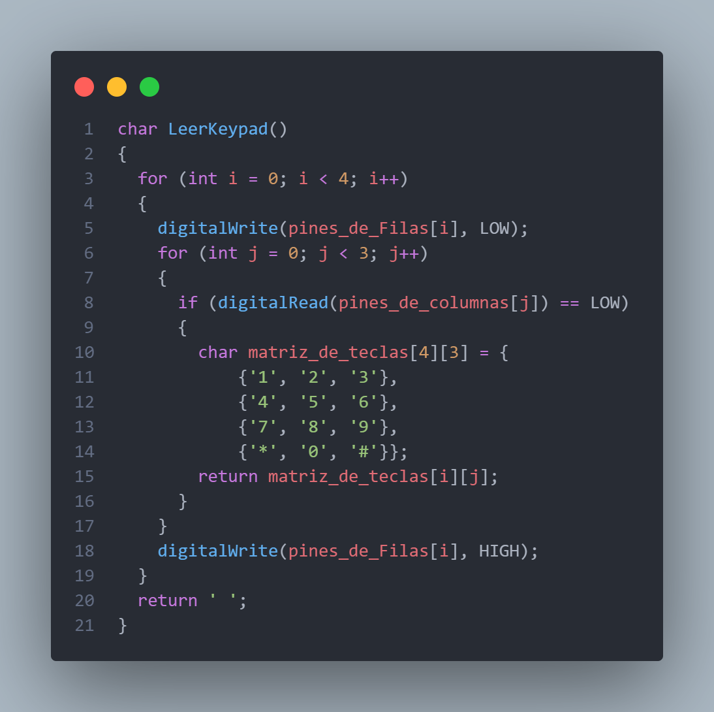
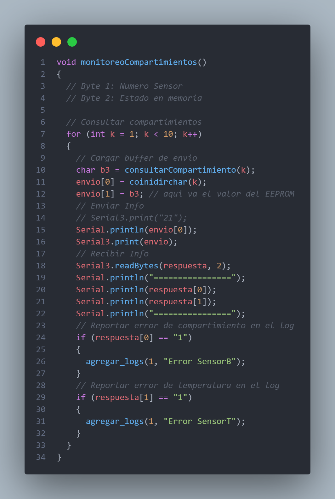

# MANUAL TÉCNICO

## COMPONENTES UTILIZADOS

- 2 Arduino Mega / Periferico, Controlador
>>
- 1 Matrice LED de 8x8
>>
- 1 Driver Max7219
>>
- 11 Push button
>>
- 11 Resistencias
>>
- 9 Sensores de temperatura
>>
- 1 Pantalla LCD
>>
- 1 Modulo HC6
>>
- 1 Keypad 3x8
>>

## CIRCUITO

## REQUERIMIENTOS DEL SISTEMA
- Sistema operativo Windows o MacOs (windows 8.1 o superior)
- Proteus v8.12
- Librerias Simulino
- 8GB de ram (minimo)

## CODIGO - AARDUINO
### Librerias utilizadas
Se utilizó la librería LedControl para el manejo de la Matriz LED con el driver Max7219.

Se utilizó la librería LiquidCrystal para el manejo de la pantalla LCD.

Se utilizó la librería EEPROM para el manejo de la memoria del Arduino.

### Variables globales

>>

### Funciones Importantes

#### Mensaje Inicial

En primera instancia se limpia la pantalla LCD y luego por un determinado numero de segundos los integrantes del grupo.
>>

>>

#### Menus

Para el despliegue de los menus or medio de estados y diferentes switchs la impresion de los diferentes menus con los que se deben interactuar, algunos reciben diferentes entradas de datos por medio del numpad para moverse a otros estados y menus diferentes.

#### Login / Ingreso Contraseña

El menu de login posee dos entradas de datos, en primera instancia solicita el ingreso de usuario que hace uso de la lectura del keypad y la concatenacion de cadena para el registro de la informacion, al igual que la contrase;a, toda esta informacion siempre se encripta.

La solicitud de datos se mantiene constante hasta que el usuario presione un boton que simboliza la confirmacion y procesamiento de datos.

#### Cerrar Sesion / Interrupcion

Al optar por cerrar sesion por parte del usuario, se habilita este metodo que actualiza a 0 el valor de la sesion/usuario activa el cual es una variable global. A su vez se presenta el apartado de interrupciones los cuales ocurren cuando se presenta una inactividad por 5 minutos por parte del usuario por lo que se cierra la sesion del usuario.

#### Registro

El menu de registro posee tres entradas de datos, en primera instancia solicita el ingreso de usuario que hace uso de la lectura del keypad y la concatenacion de cadena para el registro de la informacion, al igual que la contrase;a, toda esta informacion siempre se encripta y es registrada en la memoria para su posterior consulta.

La solicitud de datos se mantiene constante hasta que el usuario presione un boton que simboliza la confirmacion y procesamiento de datos.

#### Lectura de teclas

Para la lectura de las teclas numericas del numpad y le lectura de caracteres no presentes en el numpad que son guardados en una cadena la cual es luego procesada por diferentes metodo para comparar contrase;as de login, almacenar nuevos datos de usuarios.
>>
##### Lectura de Keypad
Este metodo registra la tecla presionadas por el usuario por medio del numpad.

##### Concatenacion de cadena

Este metodo registra los caracteres seleccionados por el usuario por medio del numpad y constantemente los agrega a la cadena que se imprime constantemente en la pantalla LCD.

#### Manejo de memoria

##### Encriptacion

Como nivel de seguridad todos los registros de usuarios ingresados en la memoria son encriptados, por medio de este metodo el cual aplica una compuerta xor a la cadena con una llave que se le define como parametro se aplica doblemente el metodo con las llaves las cuales fueron definidas como el ultimo digito del carnet mayor de los integrantes y una segunda cual fue definida como el ultimo digito del carnet menor de los integrantes. Por lo que al usar el metodo se aplica una doble encriptacion con dos llaves diferentes.

>>

##### Registro de Usuario

El metodo por medio de un offset que marca el inicio del espacio en la memoria EEPROM donde se registran los diferentes usuarios, lee los registros del tama;o de la estructura usuarios en busqueda de una coincidencia en el nombre de usuario, el cual debe ser unico, en caso de no encontrar coincidencia entre todos los registros crear un nuevo usuario que escribe directamente en la memoria con los datos proporcionados por el usuario.

>>

##### Eliminacion de Usuario

Asi como el registro de usuario por medio de un offset que marca el inicio del espacio en la memoria EEPROM donde se registran los diferentes usuarios y lee registros del tama;o de la estructura usuarios en busqueda de una coincidencia en el nombre de usuario, el cual en caso de coincidencia lo remplaza con caracteres 0 en la memoria.

>>

##### Ingreso de compartimiento

El metodo por medio de un offset que marca el inicio del espacio en la memoria EEPROM donde se registran los diferentes compartimientos, lee los registros del tama;o de la estructura compartimientos, de 2 bits, en busqueda de un compartimiento vacio del usuario activo que esta realizando el ingreso. Realiza una comunicacion serial para conocer si el usuario ya activo el compartimiento y procede a escribir en la memoria que el compartimiento esta ocupado por el usuario activo. Antes de realizar los pasos el usuario debera ingresar su contraseña de manera correcta. En caso no se encuente una coincidencia se despleguara que no hay compartimientos disponibles finalizando el metodo.

>>

##### Eliminacion de Compartimiento

El metodo por medio de un offset que marca el inicio del espacio en la memoria EEPROM donde se registran los diferentes compartimientos, lee los registros del tama;o de la estructura compartimientos, de 2 bits, en busqueda del compartimiento que se quiere eliminar, una vez encuentra la coincidencia con el compartimiento ingresado realiza una comunicacion serial para conocer si el usuario ya desactivo el compartimiento y procede a escribir en la memoria que el compartimiento ya no esta ocupado por el usuario activo. Antes de realizar los pasos el usuario debera ingresar su contraseña de manera correcta. En caso no se encuente una coincidencia se deplieguan los compartimientos que estan disponibles para ser borrados por el usuario y finalizando el metodo.

>>

##### Registro de Logs

El metodo por medio de un offset que marca el inicio del espacio en la memoria EEPROM donde se registran los logs, lee los registros en busqueda de un espacio vacio para el almacenamiento de uno nuevo. Recibe como parametros el id del log y la descripcion del log.

>>

#### Comunicacion Serial

##### Controlador

El controlador por medio de 2 bits de comunicacion se comunica con el Arduino periferico el cual retorna 2 bits de informacion los cuales indican errores en los comportamientos.

##### Periferico

El periferico por medio de 2 bits de comunicacion que recibe del arduino por medio de un case monitorea el numero de compartimiento definido por el primer bit y realiza las validaciones necesareas para comparar el compartimiento y la temperatura, que se debe encontrar en un rango de valor entre 36 y 43 ,del compartimiento y reportar error.

## CODIGO - APP

### Pantalla Inicial
  
Se elige el dispositivo Bluetooth con el que se va a comunicar desde una lista de dispositivos disponibles. Despues de haberlo seleccionado de la lista envia a la siguiente pantalla, que sería la interfaz de usuario.    

### Interfaz de Usuarios
  
Se tiene un temporizador que constantemente verifica informacion enviada desde la app mediante códigos de operación, dependiendo de este código hace una acción mostrando el contenido que necesita ser enviado desde la app o mostrando la información de los stados del sistema que se mandan. El botón de enviar, envia la información contenida en el textbox activo en el momento hacia el dispositivo bluetooth. El bóton de confirmar conexión envía al dispositivo bluetooth un mensaje para que este verifique que hay alguna conexión.   

#### Parte física:

Para la parte física se utilizaron los siguientes componentes:

-LCD 16X2
-6 Resistencias
-Arduino Uno
-2  Sensores ultrasonicos
-2 Modulos de fotorresistencias
-2 Protoboards

Se utilizaron los siguientes pines: 

 
 

Flujo del programa:

Primero se verifican que no este entrando luz para chequear que la compuerta no este abierta, luego se procede a verificar que dispositivo 
se encuentra dentro del compartimiento: 

 

Para medir la luz primero se selecciona la compuerta y luego se mide si esta abierta o cerrada: 
 

Para medir la distancia primero se verifica si hay algo, luego se chequea la distancia, si es primera vez que se realiza, el programa automaticamente almacena el telefono.

Luego se chequea la distancia entre el sensor de luz y que la del dispositivo coincidan para desplegar los mensajes en la lcd.

Debido a problemas con un sensor se opto por crear el metodo disparar 2 que en escencia es lo mismo que el primero, lamentablemente esto no logró algún efecto en ese sensor por lo tanto se le atribuye a una falla del dispositivo.