# MANUAL DE USUARIO

## DESCRIPCIÓN DEL DISPOSITIVO

Este es un dispositivo interactivo creado con ArduinoMega que está formado una pantalla LCD la cual es la encargada de ser la interfaz grafica con la cual el usuario puede interactuar como a su vez el teclado numerico con el cual podra ingresar informacion dentro del dispositivo ya sea con las teclas o bien con los botones de "Aceptar" y "Cancelar, el sistema se basa en un control de compartimientos donde diferentes usuarios pueden dejarlos para cargar sus celulares, el dispositivo cuenta con un apartado de usuarios con inicio de sesion. El dispositivo cuenta con una pantalla LED la cual es la encargada de mostrarle al usuario la informacion de los diferentes compartimientos de dispositivos como tambien desplegar los caracteres los cuales puede recorrer para ir selecciondo e ingresando.

### Disposición del dispositivo
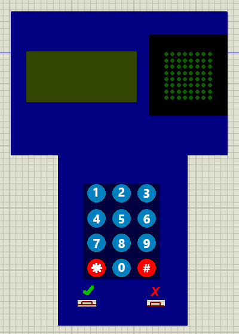

## USO DEL DISPOSITIVO

### Secuencia inicial
Al iniciar el dispositvo en la panatalla se deplegaran los nombres y carnets de los integrantes del grupo.
>>

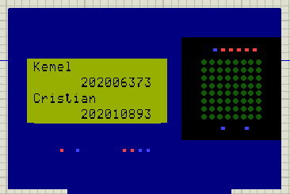

### Menú Principal

Una vez finalizada la secuencia inicial se depleguara el menu de incio donde se desplegaran difrentes opciones a las cuales el usuario puede acceder las cuales son la opcion de inicio de sesion y la opcion de registro, para acceder a estas opciones el usuario podra ingresar por medio del numpad ingresando ya se la opcion 1 o 2.

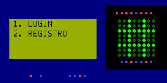

>>

### Ingreso de datos

Posterior a que el cliente se le solicite realizar una entrada de datos, sea usuario contraseña etc, en el dispositivo se le presenta en pantalla la oportunidad de poder ingresar los datos por medio del teclado o bien por medio de la aplicacion.

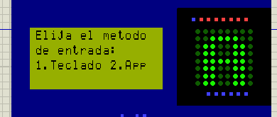

>>

### Login

Al acceder a este menu al usuario se le solicitara que ingrese su nombre de usuario y contraseña si estos son correctos podra avanzar al menu de usuario en caso contrario regresara al menu principal, para ingresar continuar el proceso debe presionar el boton de aceptar para que el sistema procese el login o el boton de cancelar para limpiar la entrada.

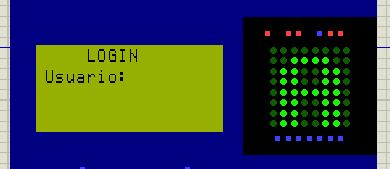

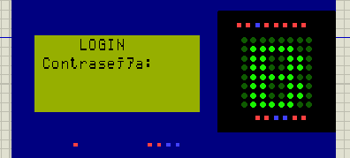

>>

### Registro

Al acceder a este menu se le solicitara al usuario ingresar un nombre de usuario, una contraseña y un numero de telefono, una vez ingresados los datos el usuario podra iniciar sesion.

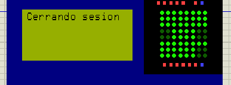

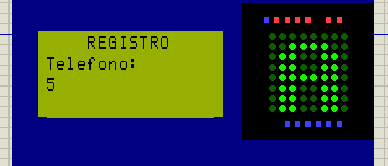

>>

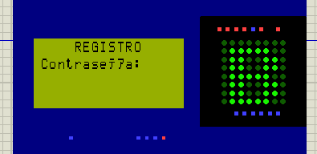

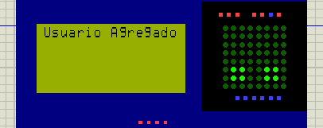

>>

### Menú de Usuario

Una vez el usuario realiza un login correcto se le desplegaran las diferentes opciones del menu de usuario las cuales son, ingreso de celular, retiro de celular, cerrar sesion y eliminacion de cuenta, para acceder a estas opciones se ingresaran por medio del teclado numerico.

En la matriz de LED se mostraran los compartimientos ocupados por el usuario.

>>

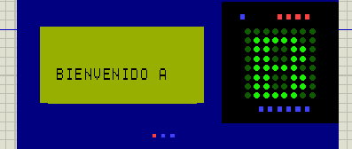

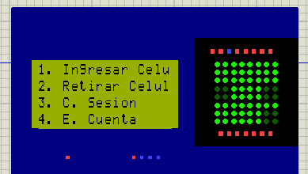

>>

### Ingreso de Celular

Al elegir la opcion de ingreso se le solicitara al usuario el ingreso de su contraseña una vez siendo correcta el sistem procedera a marcar el compartimiento y el usuario debera ingresar su celular en el compartimiento. En caso el compartimiento no se llene o el rango de temperatura no se encuente entre los 36 a 42 grados se procedera a reportar un error en los logs del sistema.

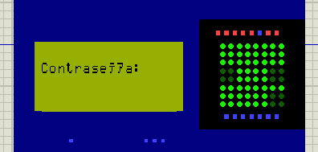

>>

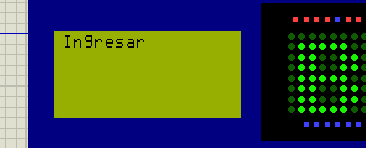

>>

### Retiro de Celular

Al elegir la opcion de ingreso se le solicitara al usuario el ingreso de su contraseña una vez siendo correcta el sistem procedera a marcar el compartimiento y el usuario debera ingresar su celular en el compartimiento. A su vez el sistema cuenta con un tiempo de incatividad el cual es de 5 minutos, donde contado este tiempo sin que el usuario manejara el dispositivo se cerrara su sesion.

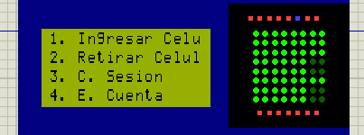

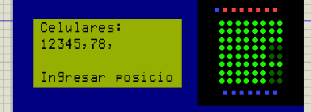

>>

### Cerrar Sesion

Al elegir la opcion de cerrar sesion el sistema terminara la sesion del usuario actual y regresara al menu principal, la sesion tambien es cerrada luego de un tiempo de incatividad de 5 minutos.

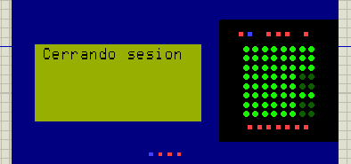

### Eliminar Cuenta

Al elegir la opcion la cuenta del usuario sera borrada del sistema y retornara al menu principal y no podra iniciar sesion nuevamente.

### Menu de Administrador

Para ingresar a este menu sera por medio del inicio de sesion del usuario administrador, se le desplegaran las opciones de ver logs y de verificar el estado del sistema.

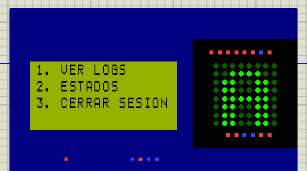

### Visualizacion de Logs

Al ingresar a esta opcion el usuario administrador podra visualizar los logs registrados al largo de la ejecucion del sistema.

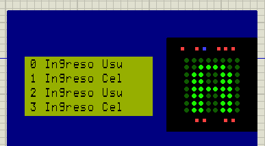

### Estado del sistema

Al ingresar a esta opcion el usuario administrador podra visualizar el estado del sistema.

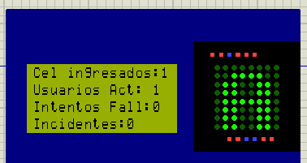

### Aplicacion

El usuario tambien tendra la opcion de poder realizar entradas de datos por medio de la aplicacion que debe tener instalada en el celular del usuario. Estas son las diferentes ventanas que se le presentan.

#### Inicio APP

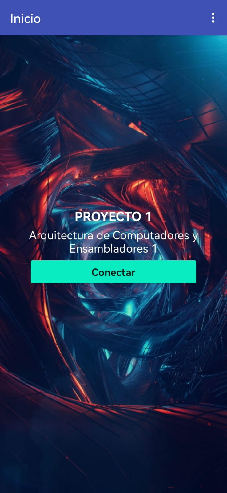

#### Conexion Bluetooth
El usuario iniciara conexion con el dispositivo por medio de conexion Bluetooth para la comunicacion e ingreso de datos.

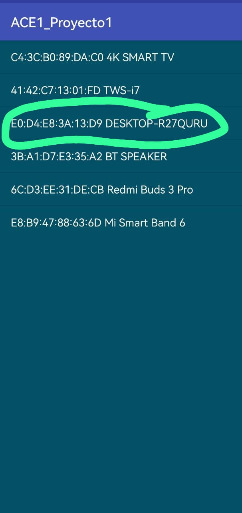

>>

#### Registros

##### Registro nombre

>>

##### Registro contraseña

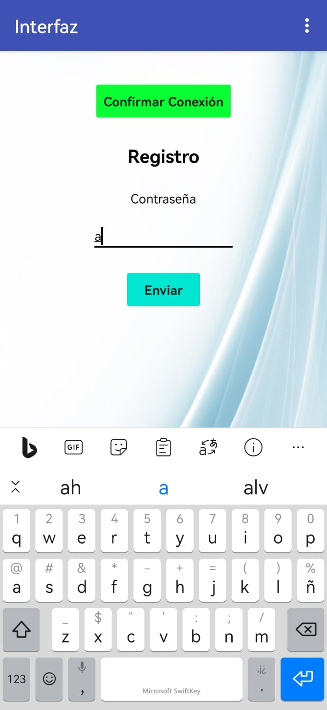

>>

##### Registro telefono

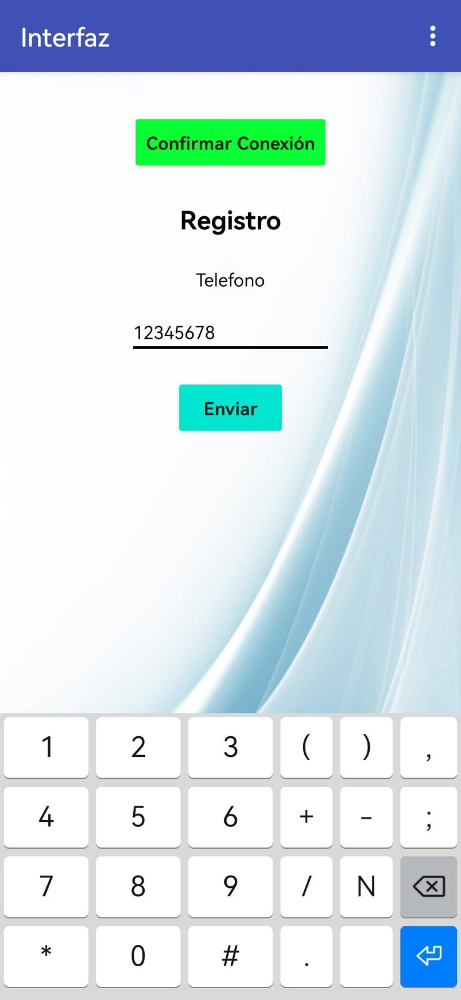

>>

#### Login

##### Ingreso nombre

>>

##### Ingreso contraseña

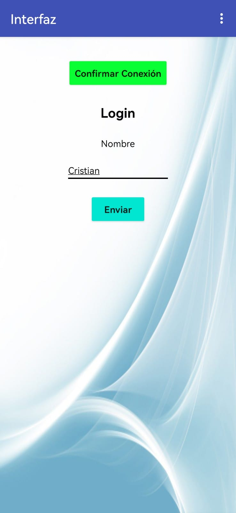

>>

#### Estado del sistema

El usuario podra consultar el estado del sistema como en el menu de Administrador.

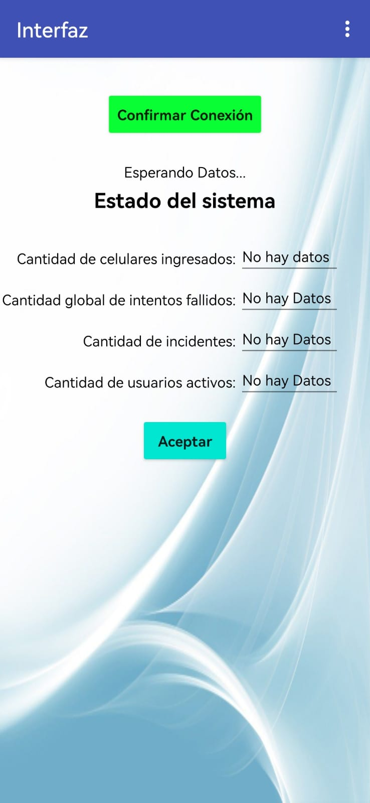

>>

### Parte física

Para la parte física se tiene que tomar en cuenta que si alguna compuerta se encuentra abierta, esta no identificará nada, por lo tanto hay que tener presente que para ingresar dispositivo tiene que estar cerrado:

Si se cambia de dispositivo, se desplegará el siguiente mensaje:

Cada una de sus acciones se verá reflejada en el led:  
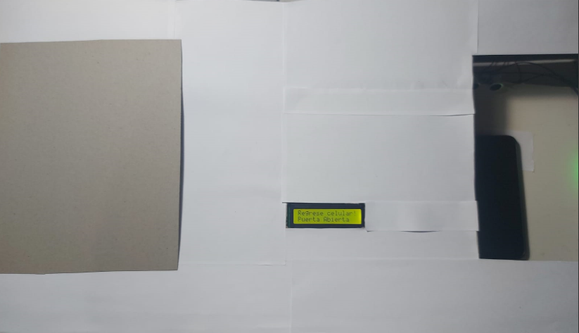 

Los mensajes disponibles son: 
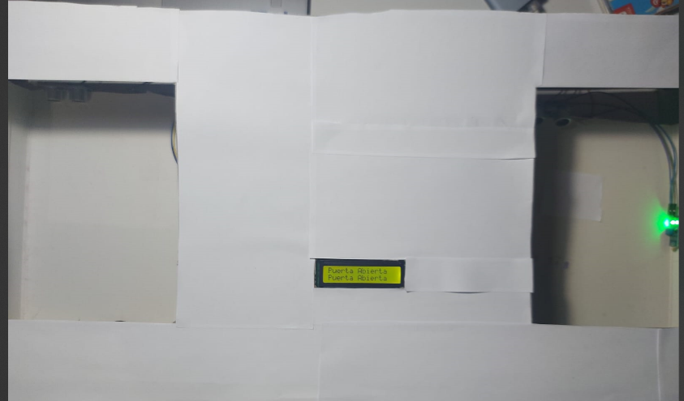 
Ocupado: Se da cuando el dispositivo es el oficial.
Ingrese celular!: Se da cuando no se tiene el dispositivo oficial.
Puerta Abierta: Cuando la puerta esta abierta.